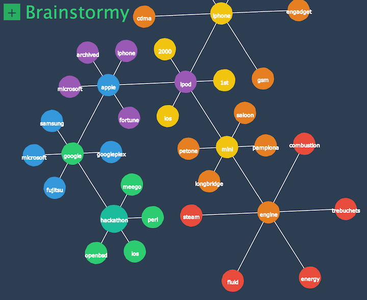

Brainstormy
===========

# Project origin
This project spawned at the occasion of Fhacktory (1st edition), a hackathon that took place in Lyon, France.
That saturday morning, we were trying hard to get a cool and innovative idea that would both impress the attendees and be useful. We got one: an app that helps you find cool and innovative ideas.
By letting you explore related concepts freely in the form of an infinite graph, Brainstormy is the perfect brainstorming assistant.

# Demo
A demo is up [over there](http://merlin.nimierdavid.fr/brainstormy/), try it out!

# Usage

1. Click on the large `+` button to start a new tree from any word of your choosing.
1. Click on any word to expand its tree by searching related word.
1. When you've found enough ideas, you can click on the **Brainstormy** logo to generate a recap of all the chosen words.